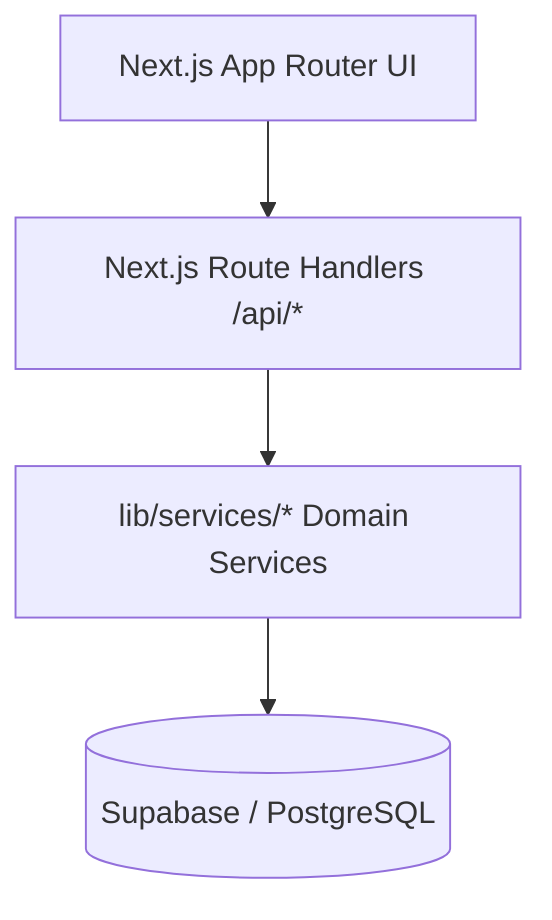
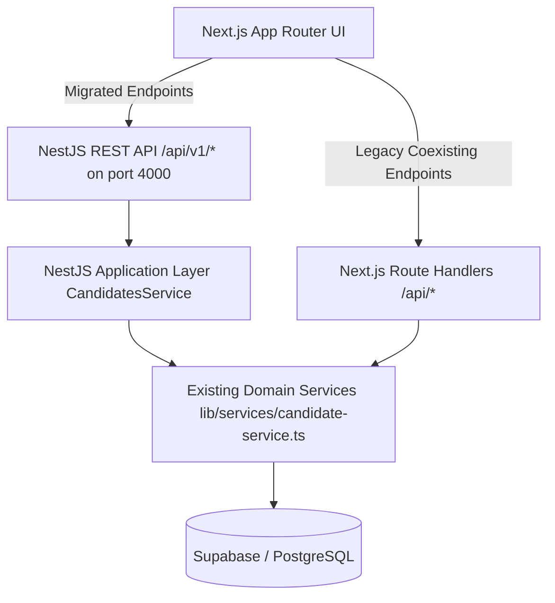

# VectorHire Architecture & Migration Document — Phase 1: NestJS Backend Foundation

## 1. Architectural Evolution

### Pre-Migration Architecture (Phase 0 Baseline)


### Phase 1 Transitional Architecture


---

## 2. Implemented NestJS Backend Structure

The NestJS backend lives in `backend/` as a modular, standalone application with its own configuration, dependency isolation, and test runner.

```
backend/
├── package.json
├── tsconfig.json
├── vitest.config.ts
├── src/
│   ├── main.ts                           # Bootstrap, CORS, ValidationPipe, GlobalPrefix /api/v1
│   ├── app.module.ts                     # Root Module with global guard, filter, interceptor
│   ├── common/
│   │   ├── filters/
│   │   │   └── http-exception.filter.ts  # Standard REST error shape: { statusCode, message, error, timestamp, path }
│   │   ├── interceptors/
│   │   │   └── logging.interceptor.ts    # Request latency & status logging
│   │   ├── decorators/
│   │   │   ├── public.decorator.ts       # @Public() route decorator
│   │   │   └── current-user.decorator.ts # @CurrentUser() param decorator
│   │   └── guards/
│   │       └── destructive-confirmation.guard.ts # Enforces x-confirm-destructive: true header
│   ├── auth/
│   │   ├── auth.module.ts
│   │   ├── auth.guard.ts                 # Cryptographic Supabase token validation; rejects client-spoofed roles
│   │   └── auth.types.ts                 # AuthUser interface
│   ├── health/
│   │   ├── health.module.ts
│   │   └── health.controller.ts          # GET /api/v1/health (public, zero secret exposure)
│   └── candidates/
│       ├── candidates.module.ts
│       ├── candidates.controller.ts      # REST endpoints for candidates
│       ├── candidates.service.ts         # Application service delegating to lib/services/candidate-service.ts
│       └── dto/
│           ├── create-candidate.dto.ts
│           └── update-candidate-status.dto.ts # Validates 15 canonical candidate statuses
└── test/
    ├── setup.ts
    ├── auth.guard.spec.ts
    ├── health.controller.spec.ts
    ├── candidates.controller.spec.ts
    └── candidates.service.spec.ts
```

---

## 3. API Endpoints Table

| Method | Endpoint | Authentication | Description | Status |
|---|---|---|---|---|
| `GET` | `/api/v1/health` | `@Public()` | Lightweight health check returning uptime and timestamp | **Active (NestJS)** |
| `GET` | `/api/v1/candidates` | Supabase Auth Guard | Lists all candidates ordered by AI score descending | **Active (NestJS)** |
| `GET` | `/api/v1/candidates/:id` | Supabase Auth Guard | Retrieves candidate profile by numeric ID | **Active (NestJS)** |
| `POST` | `/api/v1/candidates` | Supabase Auth Guard | Creates candidate record with DTO validation & timeline logging | **Active (NestJS)** |
| `PATCH` | `/api/v1/candidates/:id` | Supabase Auth Guard | Updates candidate status (enforces 15 valid statuses) & logs timeline | **Active (NestJS)** |
| `DELETE` | `/api/v1/candidates/:id` | Supabase Auth Guard | Deletes single candidate by ID | **Active (NestJS)** |
| `DELETE` | `/api/v1/candidates` | Supabase Auth + `DestructiveConfirmationGuard` | Purges candidate dataset (`x-confirm-destructive: true` required) | **Active (NestJS)** |

---

## 4. Endpoints Remaining on Next.js (Legacy Coexistence)

The following route handlers continue running via Next.js and will be migrated systematically in subsequent phases:

- `/api/candidates/import`, `/api/candidates/export`, `/api/candidates/import-test-results`
- `/api/candidates/[id]/parse-resume`, `/api/candidates/[id]/timeline`
- `/api/job-descriptions/*`
- `/api/job-matches/*`
- `/api/interviews/*`
- `/api/emails/send`
- `/api/ai/*` (`/evaluate`, `/github`, `/github/search`, `/match`, `/resume-match`)
- `/api/assessments/queue`
- `/api/auth/google/*`
- `/api/datasets`

---

## 5. Authentication & Security Architecture

1. **Supabase Auth Session Validation**:
   - NestJS `SupabaseAuthGuard` extracts the bearer token from `Authorization: Bearer <token>` or Supabase session cookies.
   - Verifies the JWT cryptographically against Supabase Auth (`supabase.auth.getUser(token)`).
   - In `production`: Requests without a valid cryptographic token are rejected with `401 Unauthorized`. Client-provided role headers (`x-demo-user`, `x-demo-role`) are completely ignored.
   - In `development`: Provides a fixed server-controlled development identity (`id: 'dev-admin-01'`) when Supabase credentials are not configured locally.
2. **Destructive Operation Safeguard**:
   - `DestructiveConfirmationGuard` enforces `x-confirm-destructive: true` on `DELETE /api/v1/candidates` as a secondary defense-in-depth confirmation following authentication.
3. **CORS**:
   - Explicitly configured from `process.env.FRONTEND_URL` / `process.env.CORS_ORIGINS` (defaults to `http://localhost:3000` in development). Rejects wildcard `*` credentials.

---

## 6. Verification Status

- **Backend Unit Tests**: 4 test suites, 21/21 tests passing (`vitest` in `backend/`).
- **Frontend & Phase 0 Unit Tests**: 6 test suites, 35/35 tests passing (`vitest` at root).
- **NestJS Build**: `npm run build:backend` compiles TypeScript with 0 errors.
- **Next.js Build**: `npm run build` compiles 31/31 routes cleanly with 0 type errors.

---

## 7. Roadmap for Subsequent Phases

- **Phase 2 — Domain & Service Migration**: Migrate remaining domain modules (`JobsModule`, `InterviewsModule`, `EmailModule`, `AIModule`, `TimelineModule`, `DatasetsModule`) into NestJS.
- **Phase 3 — Repository Pattern & Data Abstraction**: Introduce decoupled data access interfaces and database repositories.
- **Phase 4 — Redis & BullMQ Queueing**: Offload resume parsing, email dispatch, and AI evaluations to background workers.
- **Phase 5 — Observability & Telemetry**: Add structured logging, Prometheus metrics, and OpenTelemetry tracing.
- **Phase 6 — Containerization & CI/CD**: Docker multi-stage builds and automated testing workflows.
