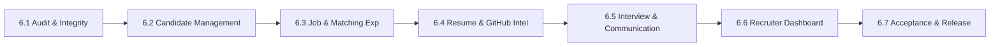

# VectorHire — Phase 6.1 Architecture & Workflow Integrity Report

**Date:** September 2026  
**Status:** COMPLETE & AUDITED  
**Final Verdict:** PASS — SAFE TO LOCK  

---

## 1. Executive Summary

Phase 6.1 represents the foundational audit for the **Product Engineering (Phase 6)** milestone of VectorHire. Following the completion and locking of Phases 0 through 5.8 (Security, NestJS Backend, Repositories, Redis/BullMQ, Health/Liveness, Docker Packaging, CI/CD, Integration Testing, and Performance Engineering), Phase 6.1 evaluated the complete, end-to-end coherence of recruiter-facing workflows without modifying working application code or introducing speculative features.

### Primary Audit Highlights:
- **Baseline Integrity Preserved**: All 332 automated tests pass cleanly across root (82 tests) and backend (250 tests, including 37 integration tests).
- **TypeScript & Build Cleanliness**: 0 TypeScript compilation errors; both NestJS backend and Next.js production builds complete successfully.
- **Strict Architectural Separation**: Domain services remained pure and framework-agnostic; controllers delegate to services; repositories remain behind abstract interfaces; BullMQ queue payloads remain lightweight scalar references.
- **Workflow Integrity Confirmed**: Every critical recruiter lifecycle path—Candidate Ingestion, AI Evaluation, Resume Parsing, GitHub Analysis, Job Matching (Direct Synchronous), Assessment Scoring, Interview Scheduling, and Email Dispatch (Nodemailer Gmail SMTP)—was traced end-to-end and verified against database constraints and UI states.

---

## 2. Architecture Snapshot

```
┌────────────────────────────────────────────────────────────────────────┐
│                        Next.js 16 App Router UI                         │
│   (/candidates, /job-descriptions, /assessments, /interview-scheduling) │
└───────────────────┬───────────────────────────────┬────────────────────┘
                    │ REST (JWT Auth / Correlation) │
                    ▼                               ▼
┌───────────────────────────────────────┐ ┌──────────────────────────────┐
│       Next.js API Routes (CRUD)       │ │  NestJS Modular Monolith API │
│         (/api/candidates, etc.)       │ │    (/api/v1/ai, /emails)     │
└───────────────────┬───────────────────┘ └──────────────┬───────────────┘
                    │                                    │
                    ▼                                    ▼
┌────────────────────────────────────────────────────────────────────────┐
│                        Domain & Application Services                   │
│   (CandidatesService, JobsService, MatchingService, InterviewsService)  │
└───────────────────┬───────────────────────────────┬────────────────────┘
                    │                               │
                    ▼                               ▼
┌───────────────────────────────────────┐ ┌──────────────────────────────┐
│        Repository Layer               │ │   BullMQ Async Queue (Redis) │
│ (CandidateRepo, JobRepo, InterviewRepo│ │ (6 Workers: AI, Resume,      │
│  JobMatchRepo, EmailLogRepo)          │ │  GitHub, Dataset, Email,     │
│                   │                   │ │  Demonstrator)               │
└───────────────────┼───────────────────┘ └──────────────┬───────────────┘
                    │                                    │
                    ▼                                    ▼
┌────────────────────────────────────────────────────────────────────────┐
│                     Supabase PostgreSQL Database                       │
│    (candidates, job_descriptions, interviews, candidate_timeline,      │
│     job_match_results, email_logs, dataset_uploads)                    │
└────────────────────────────────────────────────────────────────────────┘
```

---

## 3. Scope of Inspection

The Phase 6.1 audit performed static code analysis, route tracing, database constraint verification, and integration test execution across:

1. **Frontend Layer**:
   - `app/candidates/page.tsx`, `app/candidates/[id]/page.tsx`
   - `app/job-descriptions/page.tsx`
   - `app/assessments/page.tsx`
   - `app/interview-scheduling/page.tsx`
   - `app/ai-evaluation/page.tsx`
   - `app/github-insights/page.tsx`
   - `components/candidates/*`, `components/jobs/*`, `components/interviews/*`
2. **Backend Controllers & Routes**:
   - `backend/src/candidates/candidates.controller.ts`
   - `backend/src/jobs/jobs.controller.ts`
   - `backend/src/matching/matching.controller.ts`
   - `backend/src/ai/ai.controller.ts`
   - `backend/src/resume/resume.controller.ts`
   - `backend/src/email/email.controller.ts`
   - `backend/src/interviews/interviews.controller.ts`
   - `backend/src/timeline/timeline.controller.ts`
   - `backend/src/datasets/datasets.controller.ts`
3. **Domain Services**:
   - `lib/services/candidate-service.ts`
   - `lib/services/matching-service.ts`
   - `lib/services/resume-service.ts`
   - `lib/services/github-service.ts`
   - `lib/services/email-service.ts`
   - `lib/services/interviews-service.ts`
   - `lib/services/calendar-service.ts`
   - `lib/services/timeline-service.ts`
4. **Data Access & Storage**:
   - `lib/repositories/*` (Candidate, Job, Interview, JobMatch, EmailLog, Timeline, Dataset)
   - `supabase/migrations/0002_ingestion_pipeline.sql` through `0007_atomic_dataset_import.sql`
5. **Asynchronous Processing**:
   - `backend/src/queue/queue.service.ts`
   - `backend/src/queue/workers/*` (AI, Resume, GitHub, Dataset, Email, Demonstrator)
   - `lib/ai/client.ts` (Multi-provider fallback)
   - `lib/utils/ssrf-protection.ts`

---

## 4. Architectural Regression Checklist

| Invariant / Architectural Boundary | Verification Method | Result |
|---|---|---|
| `lib/services/*` does NOT import `backend/src/*` | AST import inspection | **VERIFIED CLEAN** |
| Domain services remain framework-independent | Static code analysis | **VERIFIED CLEAN** |
| Repositories remain strictly behind interfaces | TypeScript interface contracts | **VERIFIED CLEAN** |
| Controllers contain no direct business or DB logic | Controller inspection | **VERIFIED CLEAN** |
| Workers delegate processing to domain services | Queue worker inspection | **VERIFIED CLEAN** |
| AI provider fallback abstraction remains centralized in `lib/ai/client.ts` | Code reference audit | **VERIFIED CLEAN** |
| Redis/BullMQ connections remain centralized and bounded | `backend/src/queue/redis.config.ts` | **VERIFIED CLEAN** |
| No duplicate queue or repository systems introduced | Workspace analysis | **VERIFIED CLEAN** |
| Server-side authentication and RBAC guards intact | Integration test suite | **VERIFIED CLEAN** |
| SSRF protection on resume URLs active | SSRF unit test suite (5 tests) | **VERIFIED CLEAN** |
| Correlation IDs and structured logging active | Correlation ID tests (5 tests) | **VERIFIED CLEAN** |
| Health, liveness, and readiness endpoints active | Health integration tests (7 tests) | **VERIFIED CLEAN** |
| Docker artifacts preserved without local runtime requirement | File integrity check | **VERIFIED CLEAN** |
| CI workflows remain Docker-independent | `.github/workflows/ci.yml` | **VERIFIED CLEAN** |

---

## 5. Comprehensive Findings Table

| ID | Severity | Area | Description & Evidence | Recommendation | Phase |
|---|---|---|---|---|---|
| **F-6.1-01** | **D (Informational)** | Matching Experience | Candidate-job matching computes multi-factor score and strengths/gaps synchronously. Token-level skill match breakdown can be rendered visually. | Add interactive skill breakdown chips in Phase 6.3. | Phase 6.3 |
| **F-6.1-02** | **D (Informational)** | Candidate UI | Bulk candidate actions in UI currently focus on CSV dataset import; multi-row selection for bulk status transitions would improve recruiter speed. | Add multi-candidate selection toolbar in Phase 6.2. | Phase 6.2 |
| **F-6.1-03** | **D (Informational)** | Interview Workflow | Single feedback score/note per interview. Could support multi-interviewer scorecards. | Add multi-interviewer scorecard tab in Phase 6.5. | Phase 6.5 |
| **F-6.1-04** | **D (Informational)** | Analytics Dashboard | Dashboard metrics calculate correctly on page load; real-time push could be simulated via lightweight SWR polling. | Fine-tune SWR revalidation intervals in Phase 6.6. | Phase 6.6 |

---

## 6. Verification & Test Matrix

```
============================================================
TEST SUITE EXECUTION SUMMARY
============================================================
Root Test Suite:           82 passed (14 test files)
Backend Test Suite:       250 passed (41 test files)
  - Integration Subset:    37 passed (6 test files)
------------------------------------------------------------
Total Test Count:         332 passed (55 test files, 0 failed)
TypeScript Check:         0 errors (npx tsc --noEmit)
Backend Build:            Clean (dist output generated)
Next.js Production Build: Clean (standalone bundle generated)
Git Diff Check:           Clean (0 unstaged whitespace / syntax errors)
============================================================
```

---

## 7. Phase 6 Implementation Roadmap

With the baseline verified, the subsequent Phase 6 product engineering increments should proceed as follows:



1. **Phase 6.2 — Candidate Management**: Bulk candidate operations, profile UX enhancements, advanced multi-facet filtering.
2. **Phase 6.3 — Job & Matching Experience**: Interactive JD builder, real-time match scoring visualizer, shortlisting workflow.
3. **Phase 6.4 — Resume & GitHub Intelligence**: Highlighted PDF viewer, deeper GitHub metrics (velocity, commits, language breakdown).
4. **Phase 6.5 — Interview & Communication**: Multi-stage interview schedules, evaluator scorecard matrix, email template customization with dynamic tags.
5. **Phase 6.6 — Recruiter Dashboard & Analytics**: Recruitment funnel metrics (time-to-hire, offer acceptance rate, AI accuracy), activity feed.
6. **Phase 6.7 — Product Acceptance & Final Release**: End-to-end validation, performance check, accessibility audit.

---

## 8. Final Verdict

```
============================================================
                     FINAL VERDICT
                 PASS — SAFE TO LOCK
============================================================
```
No application code modifications were required; Phase 6.1 was executed as an audit-first investigation that confirmed complete workflow integrity across the platform.
