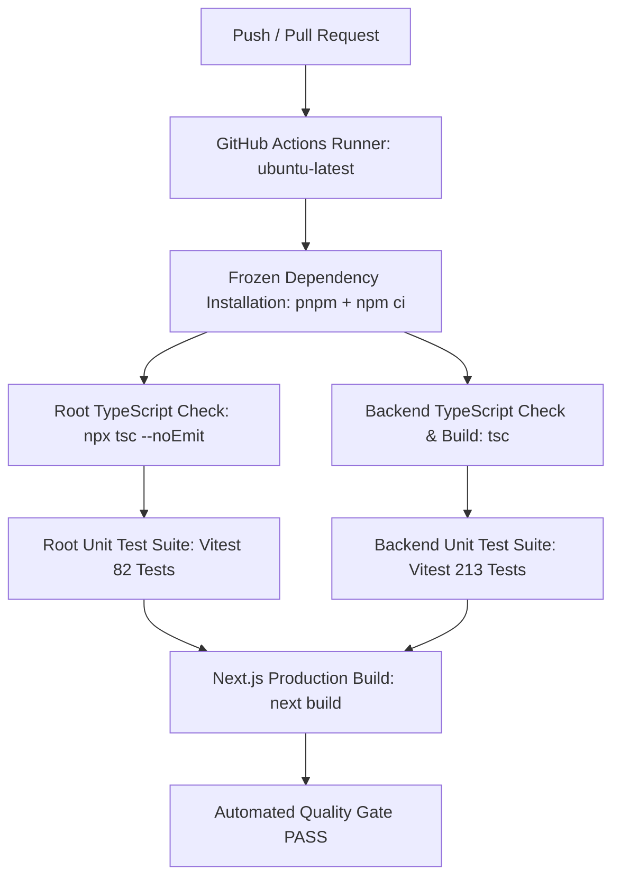

# VectorHire CI/CD & Automated Quality Gate (Phase 5.5)

This document describes the continuous integration (CI) pipeline, automated verification gates, local reproduction instructions, and development boundaries for VectorHire.

---

## 1. Overview & Architecture

VectorHire employs an automated GitHub Actions CI workflow ([`.github/workflows/ci.yml`](../.github/workflows/ci.yml)) that validates every pull request and push against strict quality gates before code is merged or deployed.



---

## 2. Workflow Triggers & Execution Policy

The workflow is configured to execute automatically under the following conditions:

- **Push Events**: Any push to `main`, `master`, or feature branches matching `feat/**`.
- **Pull Request Events**: Any pull request targeting `main` or `master`.
- **Concurrency & Cancellation**: Redundant/superseded runs on active pull request branches are automatically cancelled (`cancel-in-progress: true`), conserving runner resources.
- **Permissions**: Hardened with least-privilege permissions (`contents: read`).

---

## 3. Automated Validation Stages

Every CI pipeline run performs the following automated gates:

| Stage | Command | Purpose / Invariant |
| :--- | :--- | :--- |
| **1. Checkout & Setup** | `actions/checkout@v4`<br>`pnpm/action-setup@v4`<br>`actions/setup-node@v4` | Check out workspace with Node.js 22 LTS and cached pnpm package manager. |
| **2. Immutable Dependencies** | `pnpm install --frozen-lockfile`<br>`npm --prefix backend ci` | Verifies lockfile integrity and rejects any drift or out-of-sync dependency manifests. |
| **3. Root Typecheck** | `npx tsc --noEmit` | Validates TypeScript types across the Next.js frontend and shared `lib/` modules without code emit. |
| **4. Backend Typecheck & Build** | `npm run build:backend` | Compiles NestJS backend TypeScript (`backend/src`) to `backend/dist` via `tsc`. |
| **5. Root Unit Tests** | `npm test` | Runs the 14 root Vitest test files (82 unit tests) testing repositories, auth, utils, and validation. |
| **6. Backend Unit Tests** | `npm run test:backend` | Runs the 35 backend Vitest test files (213 unit tests) testing services, controllers, workers, guards, and health. |
| **7. Next.js Production Build** | `npm run build` | Compiles optimized Next.js 16 standalone production bundle (31 routes). |

---

## 4. Environment Variables & Secret Safety

The CI workflow operates using safe, non-sensitive mock/placeholder environment variables:

```yaml
env:
  NEXT_PUBLIC_SUPABASE_URL: "https://placeholder-project.supabase.co"
  NEXT_PUBLIC_SUPABASE_ANON_KEY: "placeholder-anon-key"
  NEXT_PUBLIC_SUPABASE_PUBLISHABLE_KEY: "placeholder-anon-key"
  SUPABASE_SERVICE_ROLE_KEY: "placeholder-service-role-key"
  REDIS_URL: "redis://127.0.0.1:6379"
```

### Security Invariants
- **No Real Secrets**: Real Supabase service role keys, database passwords, OAuth secrets, SMTP credentials, GitHub tokens, and AI provider API keys are **never** committed to the repository or required for standard CI validation.
- **Hermetic Testing**: Unit tests mock external HTTP / Supabase / Redis boundaries to ensure predictable, reproducible test runs without network dependencies.

---

## 5. Local Reproduction Guide

Developers can reproduce all CI checks locally prior to committing:

```bash
# 1. Install root & backend dependencies (ensuring lockfile match)
pnpm install --frozen-lockfile
npm --prefix backend ci

# 2. Run root TypeScript typechecking
npx tsc --noEmit

# 3. Run backend TypeScript compilation
npm run build:backend

# 4. Run root unit tests (82 tests)
npm test

# 5. Run backend unit tests (213 tests)
npm run test:backend

# 6. Run all tests together (295 tests)
npm run test:all

# 7. Run Next.js production build
npm run build

# 8. Check for git whitespace/formatting errors
git diff --check
```

---

## 6. Docker Boundary & Development Workflow

> [!IMPORTANT]
> **Docker Status**: Docker containerization is prepared but intentionally not part of the current local development workflow.

- **Phase 5.4 Artifacts**: The Docker containerization files (`Dockerfile`, `backend/Dockerfile`, `.dockerignore`, `backend/.dockerignore`, `docker-compose.yml`, `docs/ARCHITECTURE_PHASE5.4.md`) are saved and preserved in the repository for future containerized deployments.
- **Local Development**: Standard local development on 8 GB RAM machines runs natively:
  - Next.js: `npm run dev` (Port 3000)
  - NestJS: `npm run dev:backend` (Port 4000)
  - Redis: Native / local service
  - Supabase: Managed Supabase PostgreSQL instance
- **CI Independence**: Neither local development nor GitHub Actions CI requires Docker Desktop, WSL, or container runtimes.

---

## 7. Quality Gate Criteria

A pull request or branch push is considered **PASS / READY TO MERGE** only when:
1. `validate` job in GitHub Actions finishes with exit code `0`.
2. All 295+ unit tests pass (82 root + 213 backend).
3. Both root and backend TypeScript typechecks complete with 0 errors.
4. Next.js standalone and NestJS backend production builds succeed with 0 errors.
5. No dependency or lockfile drift is detected.
