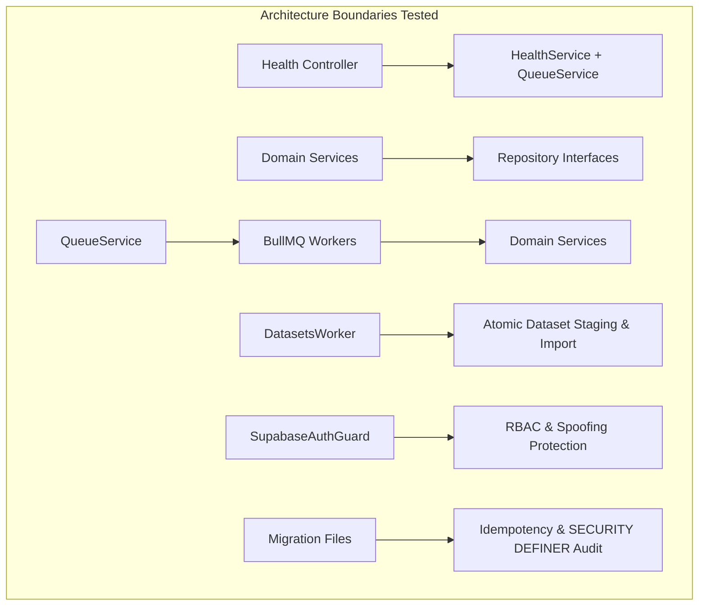

# VectorHire Integration Testing & Production Validation (Phase 5.6)

This runbook documents the integration testing architecture, coverage boundaries, execution commands, fixture strategies, and database safety invariants for VectorHire.

---

## 1. Overview & Testing Philosophy

VectorHire employs a multi-tiered test strategy:
- **Unit Tests**: Fast, localized tests isolating individual domain services, controller methods, schema validators, utility parsers, and repository query builders.
- **Integration Tests**: Tests that cross critical architectural boundaries (Controller ↔ Application Service ↔ Domain Service ↔ Repository, Queue ↔ Worker ↔ Service, and Migration Chain validation) to verify complete contracts without requiring external production infrastructure.



---

## 2. Integration Test Coverage

The integration test suite is organized under `backend/test/integration/`:

| Test Suite | File | Focus / Invariant Validated | Tests |
| :--- | :--- | :--- | :--- |
| **Health & Readiness** | [`health-readiness.integration.spec.ts`](../backend/test/integration/health-readiness.integration.spec.ts) | Process-only `/health/live` (HTTP 200 without DB/Redis), `/health/ready` dependency checks (HTTP 200 vs 503), composite `/health` metrics, error sanitization. | 7 |
| **Service ↔ Repository** | [`service-repository.integration.spec.ts`](../backend/test/integration/service-repository.integration.spec.ts) | Candidates, Jobs, Interviews, Timeline, and Matching services interacting with repository abstractions; error translation to NestJS HTTP exceptions. | 9 |
| **Queue ↔ Worker** | [`queue-worker.integration.spec.ts`](../backend/test/integration/queue-worker.integration.spec.ts) | Enqueuing with correlation IDs; worker processing across AI, Resume, GitHub, and Email workers; structured logging and shutdown lifecycle. | 7 |
| **Atomic Dataset Import** | [`dataset-import.integration.spec.ts`](../backend/test/integration/dataset-import.integration.spec.ts) | Atomic import contract ('replace' vs 'append'), CSV staging and parsing, empty row validation, and staged file cleanup. | 4 |
| **Auth & Security RBAC** | [`auth-security.integration.spec.ts`](../backend/test/integration/auth-security.integration.spec.ts) | Token verification, 401 unauthenticated enforcement, client role-spoofing rejection in production mode, and destructive confirmation guard. | 5 |
| **SQL Migration Chain** | [`migration-chain.integration.spec.ts`](../backend/test/integration/migration-chain.integration.spec.ts) | Migration sequence numbering (`0002_` to `0007_`), absence of duplicate version prefixes, idempotent DDL, `SECURITY DEFINER` and `search_path` verification on `import_dataset_atomic`. | 5 |

**Total Integration Tests**: **37 passing integration tests** across 6 test suites.

---

## 3. How to Run Integration Tests

### Running Integration Tests Exclusively
```bash
npm run test:integration
```

### Running the Full Test Suite (Unit + Integration)
```bash
# Run all root tests (82 tests)
npm test

# Run all backend tests including integration suite (250 tests)
npm run test:backend

# Run complete workspace suite (332 total tests)
npm run test:all
```

---

## 4. Docker Boundary & Development Safety

> [!IMPORTANT]
> **Docker Status**: Docker is NOT required for Phase 5.6 or for normal local development.

- **Phase 5.4 Containerization**: Dockerfiles (`Dockerfile`, `backend/Dockerfile`, `docker-compose.yml`) remain saved in the repository for future containerized deployment.
- **Local Hermetic Execution**: All integration tests execute hermetically using in-memory mocks, synthetic fixtures, and filesystem parsers without requiring Docker Desktop, WSL, or live PostgreSQL/Redis daemon processes.
- **Zero Production Mutations**: Tests never connect to or mutate real Supabase databases or live Redis clusters.

---

## 5. Database Safety & Fixture Strategy

### Safety Invariants
1. **Never use real credentials**: Tests operate using mock tokens and synthetic identifiers.
2. **Never connect to production Supabase**: Tests do not send network requests to live databases.
3. **Synthetic data only**: All candidate names (`Elena Rostova`, `Marcus Vance`), emails (`alex@example.com`), and job titles are fictional fixtures.
4. **Idempotent migration audit**: Migration tests audit SQL DDL statically to verify safety clauses (`if not exists`, `security definer`, `revoke execute ... from public`).

---

## 6. Continuous Integration (CI) Behavior

The GitHub Actions CI pipeline ([`.github/workflows/ci.yml`](../.github/workflows/ci.yml)) automatically runs the integration test suite as part of the `Run backend unit tests (Vitest)` step, ensuring zero configuration overhead while maintaining strict quality gates.

---

## 7. Known Limitations & Future Roadmap

1. **Live PostgreSQL Transaction Testing**: Direct database engine transaction rollback testing requires a dedicated live PostgreSQL instance. This is deferred until staging/containerized deployment pipelines are activated.
2. **Live Redis Cluster Failover Testing**: Testing live Redis network partitions with BullMQ is deferred to future end-to-end infrastructure testing.
