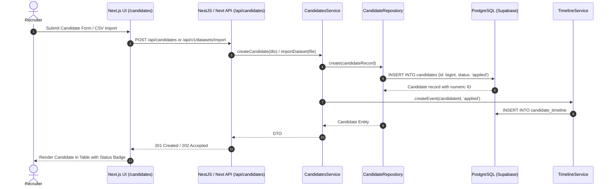
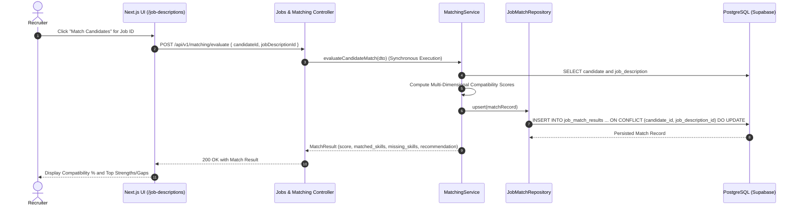
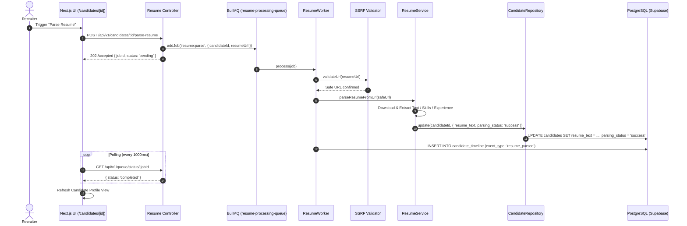
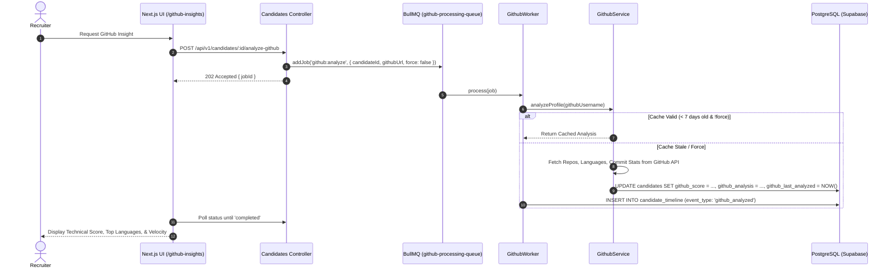
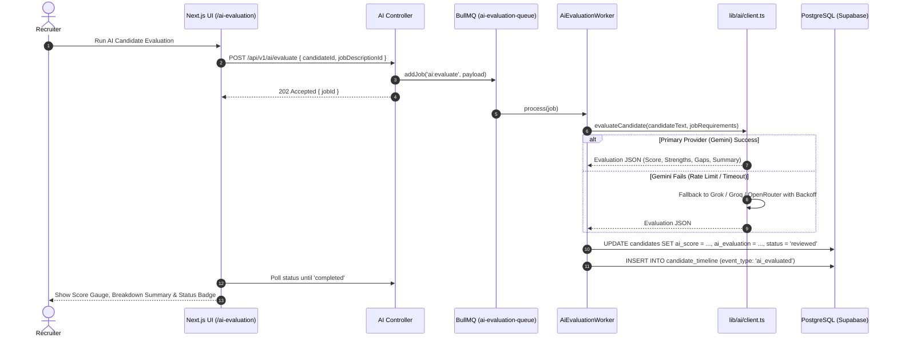
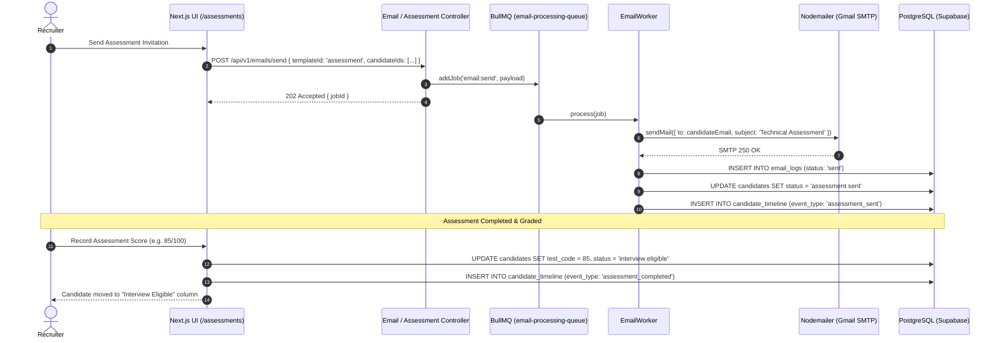
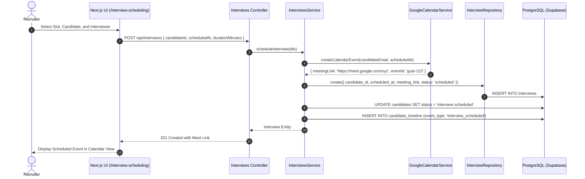
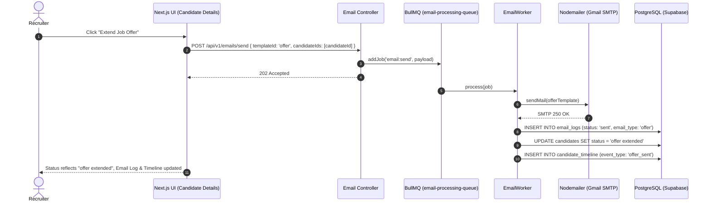

# VectorHire — Product Workflows Specification

This document maps the exact end-to-end control flows, asynchronous handshakes, data persistence layers, and recruiter interaction points across the VectorHire platform.

---

## Workflow A: Candidate Ingestion & Lifecycle

### Traceability:
- **Frontend Entry**: `app/candidates/page.tsx`, `components/candidates/AddCandidateModal.tsx`, `components/candidates/UploadModal.tsx`
- **Backend API**: `backend/src/candidates/candidates.controller.ts`, `app/api/candidates/route.ts`
- **Domain Service**: `lib/services/candidate-service.ts`, `backend/src/candidates/candidates.service.ts`
- **Repository Interface**: `lib/repositories/candidate-repository.ts`
- **Repository Implementation**: `lib/repositories/supabase-candidate-repository.ts`
- **Database Tables**: `candidates` (numeric `id bigint`), `candidate_timeline`, `dataset_uploads`
- **Database Logic**: Uses PostgreSQL `import_dataset_atomic` function (migration `0007_atomic_dataset_import.sql`) for atomic batch replacement.
- **Initial Status**: `applied`

---

## Workflow B: Job Description Lifecycle & Candidate Matching

### Traceability:
- **Frontend Entry**: `app/job-descriptions/page.tsx`, `components/jobs/MatchCandidatesModal.tsx`
- **Backend API**: `backend/src/jobs/jobs.controller.ts`, `backend/src/matching/matching.controller.ts`
- **Domain Service**: `lib/services/matching-service.ts`, `backend/src/matching/matching.service.ts`
- **Repository**: `lib/repositories/supabase-job-match-repository.ts`
- **Database Tables**: `job_descriptions`, `job_match_results`, `candidates`
- **Execution Mode**: **Direct Synchronous Execution** via REST endpoint with immediate database upsert.

---

## Workflow C: Resume Processing & Intelligence

### Traceability:
- **SSRF Gatekeeper**: `lib/utils/ssrf-protection.ts` (blocks private IP ranges, cloud metadata endpoints, loopback).
- **Drive Handler**: `lib/utils/google-drive.ts` (converts share URLs to direct streamable binaries).
- **Queue/Worker**: `backend/src/queue/workers/resume.worker.ts`, `backend/src/queue/queue.service.ts`.
- **Concurrency**: 5 concurrent worker threads.

---

## Workflow D: GitHub Intelligence Analysis

### Traceability:
- **Cache TTL**: 7 Days (`github_last_analyzed`).
- **Worker**: `backend/src/queue/workers/github.worker.ts`.
- **Timeline Event**: `github_analyzed`.

---

## Workflow E: Multi-Provider AI Candidate Evaluation

### Traceability:
- **AI Abstraction**: `lib/ai/client.ts` with exponential backoff and max 2 retries per provider.
- **Queue/Worker**: `backend/src/queue/workers/ai-evaluation.worker.ts`.
- **Status Change**: Updates candidate status in database.

---

## Workflow F: Assessment Invitation & Score Recording

### Traceability:
- **Worker**: `backend/src/queue/workers/email.worker.ts`.
- **Status Transition**: `assessment sent` → `assessment completed` / `interview eligible` (if score ≥ 60).

---

## Workflow G: Interview Scheduling & Status Flow

### Traceability:
- **Google Calendar Integration**: `lib/services/calendar-service.ts`.
- **Repository**: `lib/repositories/supabase-interview-repository.ts`.
- **Status Progression**: `interview eligible` → `interview scheduled` → `interview completed`.

---

## Workflow H: Recruiter Communication & Offer Lifecycle

### Traceability:
- **Email Log Table**: `email_logs` (`id`, `candidate_id`, `recipient`, `subject`, `email_type`, `status`, `sent_at`).
- **Terminal Statuses**: `offer extended` → `hired` / `rejected`.
